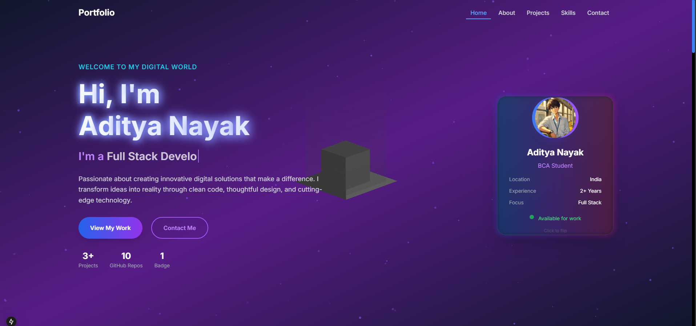
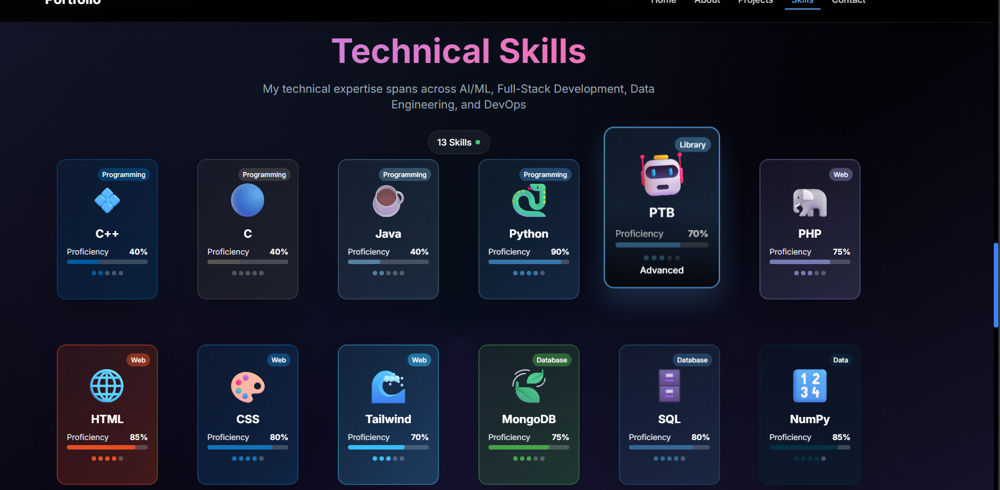
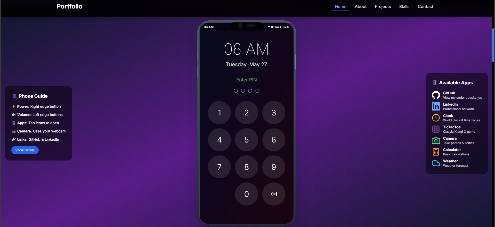

# My Portfolio

A personal portfolio website showcasing my technical skills and projects, featuring an interactive Android phone simulation.

## Screenshots

Here are some screenshots of the portfolio:





## Features

* Interactive Android phone simulation with:
  * Working lock screen with PIN authentication
  * Multiple functional apps (Clock, Calculator, TicTacToe, etc.)
  * Real-time camera integration
  * 360° view mode
  * Volume controls with OSD
* Showcase of technical skills with proficiency levels and animated cards
* Interactive contact form (using Formspree for submissions)
* Dynamic background effects
* Responsive design for various devices
* Highlighting of projects with details

## Technologies Used

* Next.js
* React
* TypeScript
* Tailwind CSS
* Framer Motion
* Three.js (for 3D effects)
* WebRTC (for camera integration)
* Formspree (for contact form submissions)

---

This project was bootstrapped with [`create-next-app`](https://nextjs.org/docs/app/api-reference/cli/create-next-app).

## Getting Started

First, run the development server:

```bash
npm run dev
# or
yarn dev
# or
pnpm dev
# or
bun dev
```

Open [http://localhost:3000](http://localhost:3000) with your browser to see the result.

You can start editing the page by modifying `app/page.tsx`. The page auto-updates as you edit the file.

This project uses [`next/font`](https://nextjs.org/docs/app/building-your-application/optimizing/fonts) to automatically optimize and load [Geist](https://vercel.com/font), a new font family for Vercel.

## Learn More

To learn more about Next.js, take a look at the following resources:

- [Next.js Documentation](https://nextjs.org/docs) - learn about Next.js features and API.
- [Learn Next.js](https://nextjs.org/learn) - an interactive Next.js tutorial.

You can check out [the Next.js GitHub repository](https://github.com/vercel/next.js) - your feedback and contributions are welcome!

## Deployment

The easiest way to deploy your Next.js app is to use the [Vercel Platform](https://vercel.com/new?utm_medium=default-template&filter=next.js&utm_source=create-next-app&utm_campaign=create-next-app-readme) from the creators of Next.js.

Check out our [Next.js deployment documentation](https://nextjs.org/docs/app/building-your-application/deploying) for more details.

To deploy on GitHub Pages, you may need to make additional configurations specific to Next.js deployment on static hosting.

## Contact

If you'd like to get in touch, please use the contact form on my portfolio website or connect with me via the social links provided there.

---
